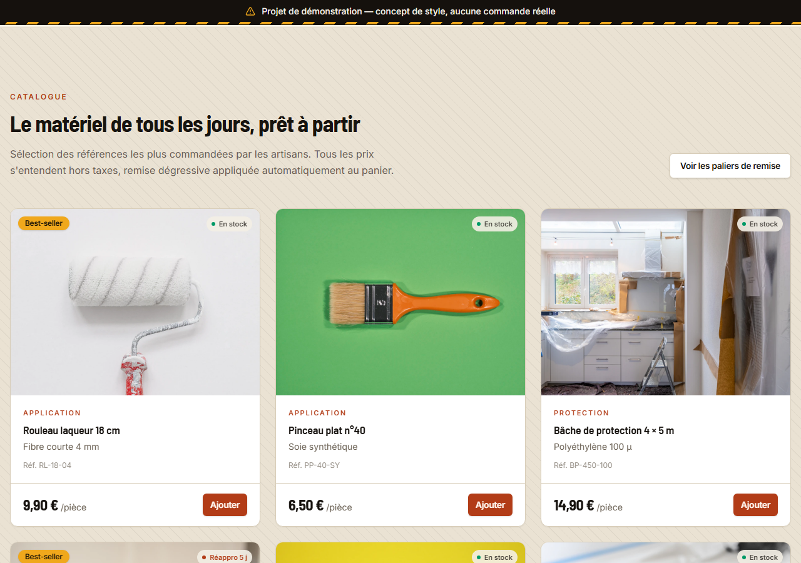
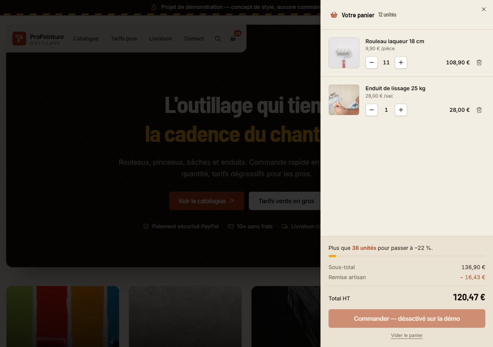
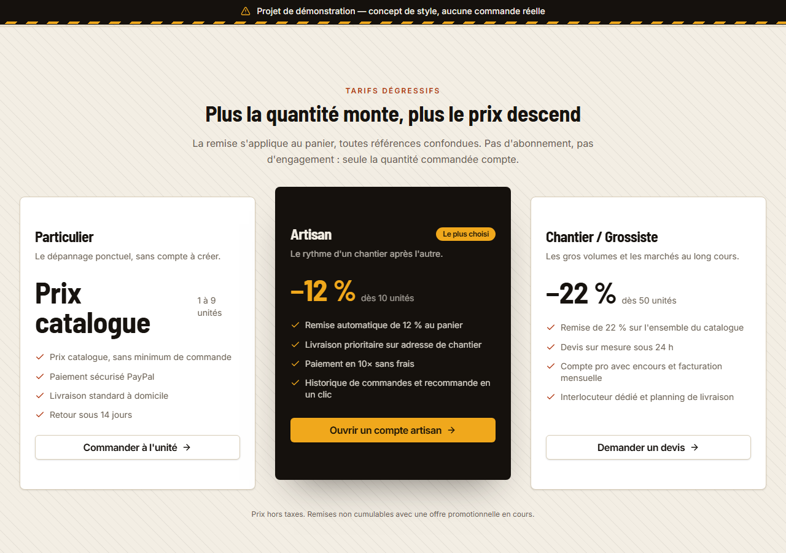

# ProPeinture Outillage — concept de boutique

Projet de démonstration / portfolio : concept de boutique en ligne d'outillage
et de matériel pour peintres professionnels. **Aucune commande réelle**, aucune
société derrière, aucun paiement branché — un bandeau permanent le rappelle en
haut de page.

## Aperçu


Le hero et sa barre de navigation. Le panneau charbon et l'encoche claire du
header donnent le contraste ; les quatre vignettes de catégories suivent juste
en dessous.



Le catalogue. Chaque carte porte sa photo en plein cadre, son état de stock, sa
référence et son prix à l'unité.



Le panier, seule partie réellement fonctionnelle du concept : la remise se
recalcule à chaque changement de quantité et la jauge annonce ce qui manque
pour atteindre le palier suivant.



Les tarifs dégressifs. Le palier atteint par le panier en cours y est signalé
« Votre palier ».


En mobile, la navigation se replie dans un panneau latéral.

Les captures se régénèrent avec le serveur de dev lancé :

```bash
npm run captures
```

Le script utilise le Chrome installé sur la machine, sans télécharger de
navigateur (`CHROME_PATH=...` pour en désigner un autre).

## Stack

- Vite 6 + React 19 + TypeScript
- Tailwind CSS v4 (plugin `@tailwindcss/vite`, thème en variables CSS)
- Composants shadcn/ui (`new-york`, base `stone`) : `button`, `badge`, `card`,
  `separator`, `sheet`
- `lucide-react` pour les icônes ; aucune librairie d'animation, tout est en CSS

## Composants issus du catalogue 21st.dev

Chaque section part d'un composant du catalogue, récupéré via le MCP 21st
(`search` + `get_component`), puis adapté : contenu sorti en props, textes en
français, palette du projet.

| Section | Composant d'origine | Auteur |
|---|---|---|
| Header + hero | [Commerce Hero](https://21st.dev/@bankkroll/components/commerce-hero) | bankkroll |
| Grille produits | [Product Card](https://21st.dev/@ravikatiyar162/components/product-card-2) | ravikatiyar162 |
| Tarifs dégressifs | [Pricing Section 1](https://21st.dev/@shadcnstore/components/pricing-section-1) | shadcnstore |
| Footer | [Minimal Footer](https://21st.dev/@efferd/components/minimal-footer) | efferd |

Les adaptations sont documentées en tête de chaque fichier dans
`src/components/ui/`.

## Le panier et les remises

C'est le seul comportement réel du projet, et le cœur du concept : la remise
dépend du **nombre total d'unités du panier, toutes références confondues**.

| Palier | À partir de | Remise |
|---|---|---|
| Particulier | 1 unité | prix catalogue |
| Artisan | 10 unités | −12 % |
| Chantier / Grossiste | 50 unités | −22 % |

Le barème et les calculs vivent dans [`src/lib/tarifs.ts`](src/lib/tarifs.ts),
en fonctions pures et sans dépendance à React — le reste n'en est que
l'affichage. L'état du panier est un `useReducer` exposé par
[`src/panier/PanierContext.tsx`](src/panier/PanierContext.tsx).

Le panneau annonce en continu ce qui manque pour le palier suivant, et la
section tarifs marque « Votre palier » sur celui qui s'applique. Le bouton
« Commander » est volontairement désactivé : il n'y a ni back-end ni paiement.

## Démarrer

```bash
npm install
npm run dev
```

Build de production : `npm run build`, puis `npm run preview`.

## Structure

```
docs/captures/       les images de l'aperçu ci-dessus
scripts/captures.mjs le script qui les régénère
src/
  components/
    ui/               composants shadcn/ui + les 4 composants 21st adaptés
    sections/         BandeauDemo, Hero, GrilleProduits, TarifsDegressifs,
                      BandeLivraison, Footer — de fines enveloppes qui
                      alimentent les composants ui/ en contenu français
    Marque.tsx        le logo, partagé header / footer
  data/produits.ts    les 6 références du catalogue + les 4 catégories
  lib/tarifs.ts       le barème dégressif, en fonctions pures
  lib/utils.ts        cn() et formatage des prix en euros (fr-FR)
  panier/             l'état du panier (useReducer + contexte)
  index.css           palette, polices et thème Tailwind v4
```

## Palette et typographie

Univers artisanal / BTP plutôt que SaaS, construit sur un écart de valeurs
franc : chaux `#f3eee4` en fond de page, blanc pur `#ffffff` pour les cartes
produit — ce sont les photos qui doivent porter la couleur —, charbon `#15110d`
pour ancrer le hero, le palier tarifaire mis en avant et le footer, brique
brûlée `#b23c17` en couleur principale et jaune de balisage `#f0a81c` en accent.
Deux motifs accompagnent le thème : `bg-tarp` / `bg-tarp-dark` (trame diagonale
façon bâche) et `bg-hazard` (liseré de balisage).

Titres et marque en **Barlow Semi Condensed** (police de signalétique), texte
courant en **Inter**, les deux chargées depuis Google Fonts dans `index.html`.

## Photos

Les visuels produit et catégories sont dans `public/produits/` (WebP, 1000 px de
large) et référencés par leur chemin dans `data/produits.ts` — aucune dépendance
réseau à l'exécution. Leur provenance est listée dans
[`public/produits/SOURCES.md`](public/produits/SOURCES.md). Pour une vraie
boutique, remplacer les fichiers en gardant les mêmes noms.

## Notes

- Tous les boutons sont inertes : c'est une maquette de style, pas une
  boutique. Aucun panier, aucun back-end, aucun moyen de paiement branché.
- Les apparitions et les effets de survol sont en CSS pur, sans librairie
  d'animation. L'utilitaire `animate-apparition` (défini dans `index.css`) monte
  en `animation-fill-mode: both`, donc l'élément finit toujours visible ; la
  cascade se règle avec `animation-delay` en style inline, et tout est neutralisé
  sous `prefers-reduced-motion: reduce`.
- Si vous déplacez le projet dans un dossier Windows redirigé (OneDrive, dossier
  d'une application packagée), le serveur de dev peut servir les sources non
  transformées : il faut alors ancrer `root` sur `fs.realpathSync(__dirname)` et
  poser `server.fs.strict: false` dans `vite.config.ts`. Inutile ici.
