# ProPeinture Outillage — concept de boutique

Projet de démonstration / portfolio : concept de boutique en ligne d'outillage
et de matériel pour peintres professionnels. **Aucune commande réelle**, aucune
société derrière, aucun paiement branché — un bandeau permanent le rappelle en
haut de page.

**Démo en ligne : https://yboukamir.github.io/propeinture-outillage/**

Le pied de page du site renvoie ici : le lien parle de la maquette et non de
la boutique, il vit donc avec les mentions, pas dans les colonnes du magasin.

## Aperçu

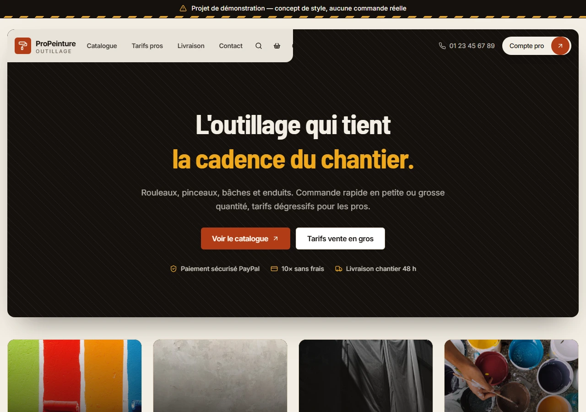

Le hero et sa barre de navigation. Le panneau charbon et l'encoche claire du
header donnent le contraste ; les quatre vignettes de catégories suivent juste
en dessous.

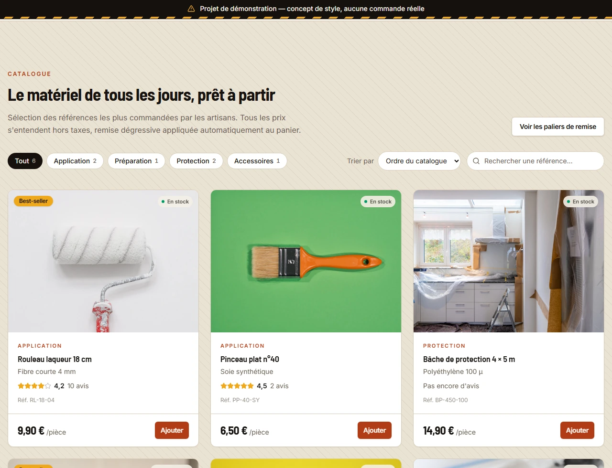

Le catalogue, sa recherche, son tri et ses filtres par catégorie. Chaque carte
porte sa photo en plein cadre, son état de stock, sa note moyenne, sa référence
et son prix à l'unité.

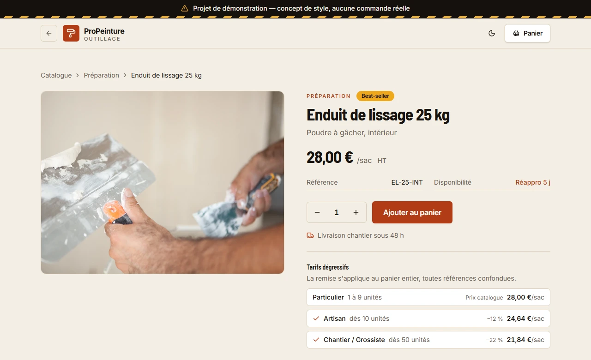

La fiche produit, atteinte en cliquant une carte. Elle décline le prix unitaire
à chaque palier, en euros plutôt qu'en pourcentage.

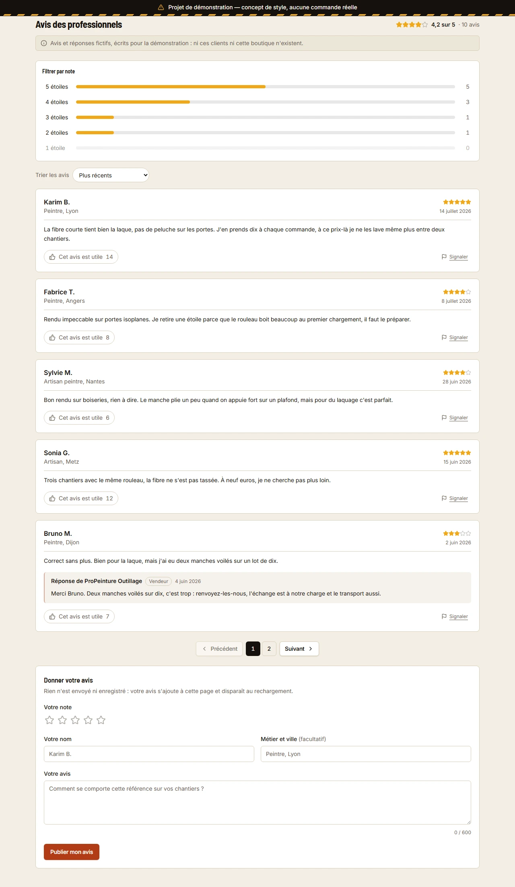

Les avis, en bas de fiche : panneau de filtres — histogramme des notes et
avis répondus —, tri, liste avec boutons d'utilité, de partage et de
signalement,
réponses du vendeur, pagination et formulaire de dépôt. La mention d'avis fictifs est en clair
au-dessus, et le formulaire annonce avant la saisie que rien n'est envoyé.


Le panier, seule partie réellement fonctionnelle du concept : la remise se
recalcule à chaque changement de quantité et la jauge annonce ce qui manque
pour atteindre le palier suivant.

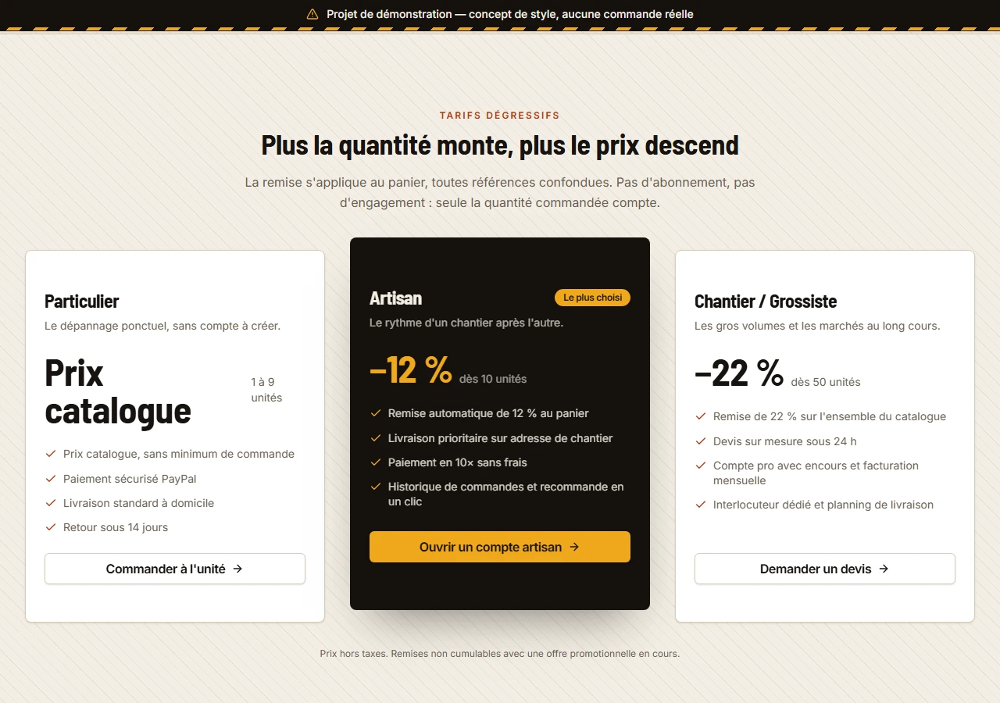

Les tarifs dégressifs. Le palier atteint par le panier en cours y est signalé
« Votre palier ».

| L'accueil | Le catalogue |
|---|---|
| 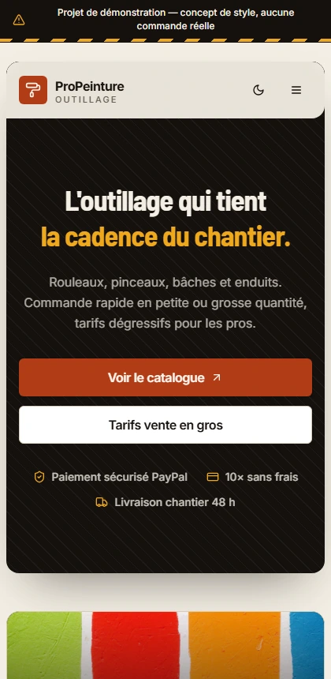 | 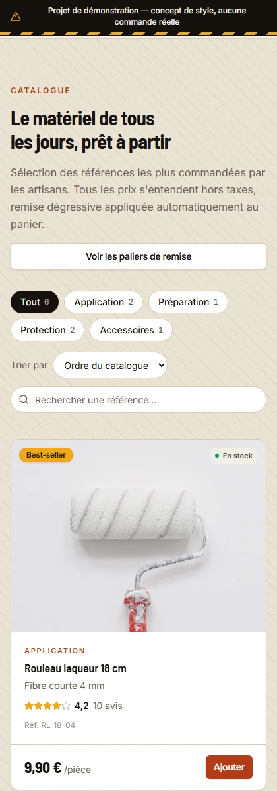 |
| **La fiche produit** | **Le panier** |
| 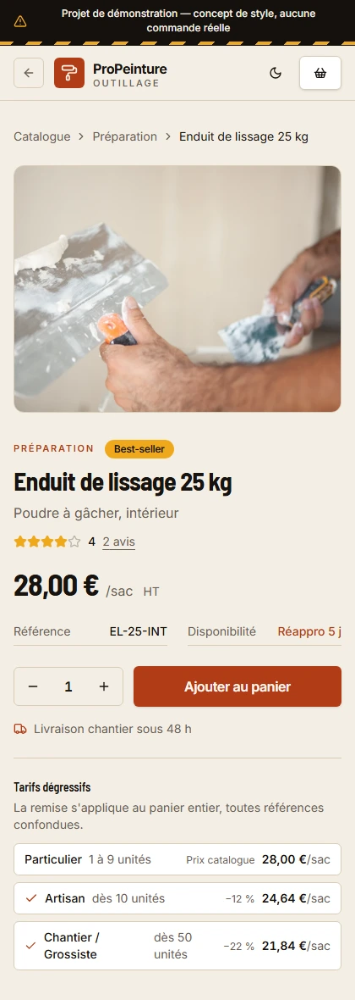 | 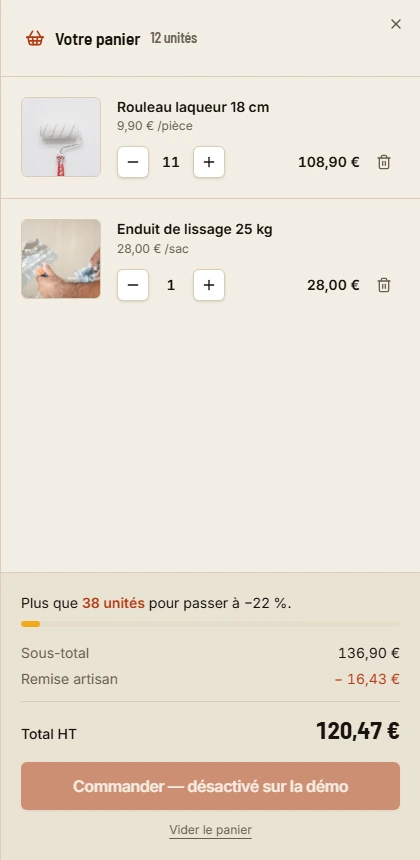 |

En mobile, la navigation se replie dans un panneau latéral, les filtres du
catalogue passent à la ligne, les cartes descendent en une colonne et le
panier occupe tout l'écran. Ce sont les mêmes pages qu'au-dessus, à 420 px :
même fiche, même panier à douze unités avec sa remise artisan — seule la mise
en page change.

La fiche mobile a d'ailleurs révélé un défaut de typographie : le tableau des
paliers y est assez étroit pour que « −22 % » se coupe entre le nombre et le
signe. L'espace de `formatRemise` est devenue insécable, comme celle qu'`Intl`
place déjà devant l'euro, et le test le vérifie.

Les deux façons d'échouer, volontairement distinctes :

| Référence inconnue, dans l'appli | Chemin inconnu, servi par l'hébergeur |
|---|---|
| 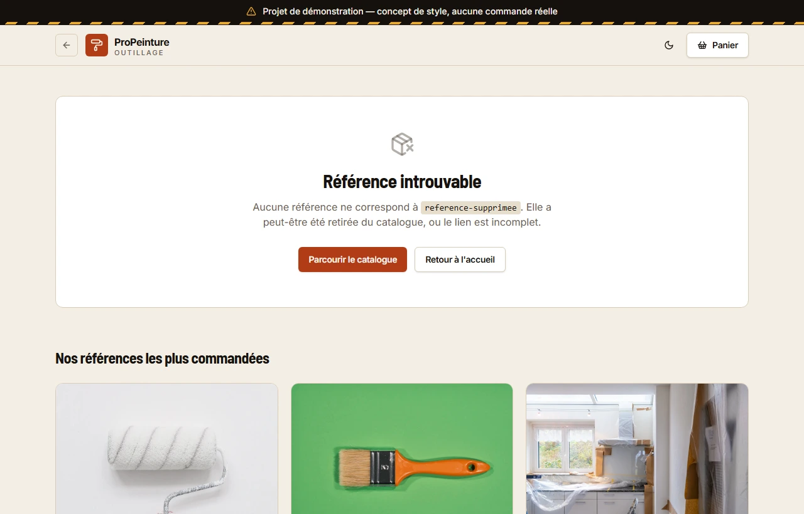 | 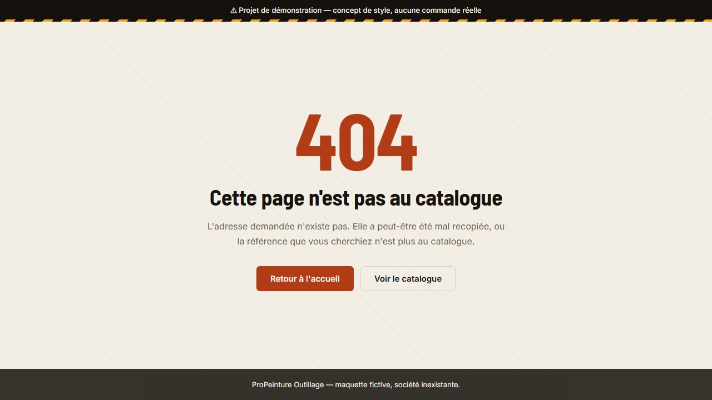 |
| L'adresse est valide, son contenu manque : on garde l'en-tête, le panier et l'URL. | L'adresse n'existe pas : page autonome, hors application. |

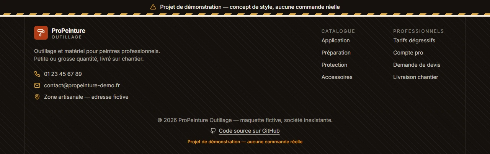

Le pied de page, avec le bandeau de démonstration qui reste collé en haut de
l'écran. Les coordonnées sont fictives comme le reste ; le lien vers le code
est le seul de la page qui mène quelque part de réel, et il est rangé avec les
mentions pour cette raison.

Les captures ci-dessus sont en thème clair ; `docs/captures/` contient les
mêmes en sombre, suffixées `-sombre`. Elles se régénèrent toutes, dans les deux
thèmes, avec le serveur de dev lancé :

```bash
npm run captures
```

Le script utilise le Chrome installé sur la machine, sans télécharger de
navigateur (`CHROME_PATH=...` pour en désigner un autre). Le thème est obtenu
en émulant la préférence système, chaque passe dans un contexte de navigation
neuf.

## Stack

- Vite 6 + React 19 + TypeScript
- Tailwind CSS v4 (plugin `@tailwindcss/vite`, thème en variables CSS)
- Composants shadcn/ui (`new-york`, base `stone`) : `button`, `badge`, `card`,
  `separator`, `sheet`
- `lucide-react` pour les icônes ; aucune librairie d'animation, tout est en CSS

## Composants issus du catalogue 21st.dev

Chaque section part d'un composant du catalogue, récupéré via le MCP 21st
(`search` + `get_component`), puis adapté : contenu sorti en props, textes en
français, palette du projet.

| Section | Composant d'origine | Auteur |
|---|---|---|
| Header + hero | [Commerce Hero](https://21st.dev/@bankkroll/components/commerce-hero) | bankkroll |
| Grille produits | [Product Card](https://21st.dev/@ravikatiyar162/components/product-card-2) | ravikatiyar162 |
| Tarifs dégressifs | [Pricing Section 1](https://21st.dev/@shadcnstore/components/pricing-section-1) | shadcnstore |
| Footer | [Minimal Footer](https://21st.dev/@efferd/components/minimal-footer) | efferd |

Les adaptations sont documentées en tête de chaque fichier dans
`src/components/ui/`.

## Le panier et les remises

C'est le seul comportement réel du projet, et le cœur du concept : la remise
dépend du **nombre total d'unités du panier, toutes références confondues**.

| Palier | À partir de | Remise |
|---|---|---|
| Particulier | 1 unité | prix catalogue |
| Artisan | 10 unités | −12 % |
| Chantier / Grossiste | 50 unités | −22 % |

Le barème et les calculs vivent dans [`src/lib/tarifs.ts`](src/lib/tarifs.ts),
en fonctions pures et sans dépendance à React — le reste n'en est que
l'affichage. L'état du panier est un `useReducer` exposé par
[`src/panier/PanierContext.tsx`](src/panier/PanierContext.tsx).

Le panneau annonce en continu ce qui manque pour le palier suivant, et la
section tarifs marque « Votre palier » sur celui qui s'applique. Le bouton
« Commander » est volontairement désactivé : il n'y a ni back-end ni paiement.

## La note sur les cartes

Le travail sur les avis ne se voyait que sur la fiche produit ; la vitrine
l'ignorait. Chaque carte du catalogue porte donc sa note moyenne et son nombre
d'avis, et le catalogue se trie par « Mieux notés ».

Une référence sans avis affiche « Pas encore d'avis » plutôt qu'un « 0 avis »
qui ressemblerait à une mauvaise note — même formulation que sur la fiche. Au
tri, elle passe derrière les notées : la ranger comme un zéro la ferait passer
pour mauvaise, la ranger comme un cinq la mettrait en tête sans rien avoir
prouvé. À égalité de moyenne, le plus grand nombre d'avis l'emporte : 4,5 sur
dix retours pèse plus lourd que 4,5 sur deux.

Ce tri a révélé un défaut : `useTri` validait l'URL contre une liste de
valeurs recopiée à la main, si bien que `?tri=note-desc` retombait
silencieusement sur l'ordre du catalogue. La validation se fait maintenant
contre `TRIS`, la liste même des options affichées, et un test le vérifie
pour chacune.

## Les avis

Fictifs, comme la boutique et son catalogue — la section le dit explicitement,
un avis inventé se prenant plus facilement au sérieux qu'un prix inventé. Ils
vivent dans [`src/data/avis.ts`](src/data/avis.ts), avec la moyenne calculée à
partir d'eux plutôt que saisie à la main.

Quatre des six références en ont, les deux autres affichant l'absence d'avis :
une vitrine réelle a toujours des fiches sans retour, autant que la maquette le
montre.

Les étoiles sont décoratives et la note est portée par un texte lisible — un
lecteur d'écran annonce « 4,7 sur 5 » au lieu d'énumérer cinq icônes. Là où la
valeur est déjà écrite à côté, ce texte est muselé pour ne pas être annoncé
deux fois.

Un formulaire permet d'en déposer un : note en étoiles, nom, métier facultatif
et texte, avec validation à la soumission — messages d'erreur reliés aux champs
par `aria-describedby`, `aria-invalid`, et focus porté sur le premier champ
fautif. L'avis rejoint la liste, porte la mention « Non enregistré » et pèse
sur la moyenne, mais rien n'est envoyé : il disparaît au rechargement, ce que
le formulaire annonce avant la saisie.

Les avis déposés vivent dans `PageProduit` et non dans la section, pour que le
résumé sous le titre et la liste ne puissent pas afficher deux chiffres
différents. Une clé sur la fiche les remet à zéro d'un produit à l'autre.

Chaque avis porte un bouton « Cet avis est utile » avec son compteur. Le vote
bascule au second clic, incrémente le compteur affiché et signale « Compté
seulement ici » — rien n'est envoyé, comme le reste de la maquette. Un avis
déposé depuis la page démarre à zéro.

Quatre avis portent une réponse publique de la boutique, décalée sous l'avis
auquel elle répond et signée d'un badge « Vendeur ». Elle a son propre
signalement : on peut trouver la réponse déplacée sans rien reprocher à
l'avis. Son libellé nomme ce qu'il vise — « Signaler la réponse », « Annuler
le signalement de la réponse » —, sans quoi deux boutons homonymes se
suivraient dans la même carte. Le champ est facultatif :
un vendeur ne répond pas à tout, et une réponse sous chaque avis sonnerait
faux. Ce sont les avis mitigés qui en reçoivent une, comme sur une vraie
vitrine, avec une date forcément postérieure à celle de l'avis. La rangée
d'actions reste sous la réponse : elle porte sur l'avis, pas sur elle.

Un bouton « Partager » copie un lien profond vers l'avis, de la forme
`?produit=rouleau-laqueur-18#avis-av-16`. Le lien vise un avis et non une
page : à l'ouverture, la fiche cherche cet avis dans la liste, ouvre la page
qui le contient, y défile et le marque d'un liseré — sans quoi le lecteur
arriverait devant cinq avis sans savoir lequel on lui montre. L'ancre est
relue au `hashchange` : suivre un lien vers la même fiche ne recharge rien,
l'effet de montage ne se rejouerait pas. Si le presse-papiers refuse — hors
contexte sécurisé, permission retirée —, le lien part dans la barre d'adresse
et la confirmation le dit : un partage qui échoue en silence serait pire que
les deux.

Un lien « Signaler » discret, aligné à droite, complète la rangée. Il n'y a
aucune modération derrière : l'avis reste affiché et la mention « Signalé, rien
n'a été envoyé » le dit à côté. Le signalement est annulable sur le même
bouton, dont seul le libellé change — un clic par erreur ne doit pas être une
impasse, et remplacer le bouton par un autre élément ferait perdre le focus au
clavier. Un avis déposé depuis la page n'en porte pas : on ne se signale pas
soi-même. La rangée passe à la ligne sur mobile, où un avis à la fois voté et
signalé ne tient pas sur une seule.

Un histogramme des notes sert aussi de filtre : chaque barre montre combien
d'avis portent cette note et s'active au clic, un second clic la désactivant —
pas besoin d'un bouton « tout » à côté. Les notes sans avis sont désactivées,
et déposer un avis lève le filtre en cours, sans quoi le nouvel avis serait
invisible s'il tombait hors du filtre. Une bascule « Avec réponse du vendeur »
complète le panneau, absente des fiches où personne n'a répondu.

Les deux critères se cumulent et leurs compteurs sont des facettes : chacun
annonce ce que donnerait ce choix-là, l'autre critère appliqué mais pas le
sien — sans cette exclusion, sélectionner une note mettrait toutes les autres
lignes à zéro. Les barres se rebasent sur le lot que l'autre critère laisse.
Un compteur à zéro éteint son critère, si bien qu'aucun croisement vide n'est
atteignable : le panneau ne propose jamais un clic qui ne donnerait rien. La
bascule est éteinte, pas masquée, quand c'est la note choisie qui ne laisse
aucune réponse — un contrôle qui disparaît sous le doigt est pire qu'un
contrôle grisé. Le code garde malgré tout un état « aucun avis ne correspond »,
en filet : une liste vide sans un mot serait pire qu'une branche jamais
empruntée.

Déposer un avis remet aussi le tri sur « Plus récents », pour la même raison : daté du jour, l'avis serait dernier sous
« Plus anciens » et perdu au milieu sous un tri par note. La moyenne et le
total en tête portent toujours sur l'ensemble : ils doivent parler du même lot.

Les avis se trient par date — du plus récent ou du plus ancien —, par utilité
ou par note, avec un départage par date décroissante pour que la liste reste
stable. Les données arrivant déjà de la plus récente à la plus ancienne, ces
deux tris-là ne trient rien : l'un les laisse en place, l'autre les renverse.
Le tri par utilité porte sur le compteur tel qu'il s'affiche, vote du visiteur
compris : sinon l'ordre contredirait les chiffres sous les yeux du lecteur.

Un dernier tri remonte les avis auxquels la boutique a répondu. Il est libellé
« Avec réponse d'abord » et non « par nombre de réponses » : la boutique répond
au plus une fois par avis, le nombre vaut zéro ou un, et le tri est donc un
regroupement. L'option disparaît des fiches où personne n'a répondu, où elle ne
ferait rien.
Ce tri-là reste en état local, contrairement à celui du catalogue : la règle
suivie est que l'URL porte ce qu'on regarde — fiche, filtre, recherche, ordre
du catalogue — et l'état local la façon de le lire à l'intérieur d'une vue.

La liste se pagine au-delà de cinq avis. La page courante est bornée au rendu
plutôt que corrigée après coup : filtrer sur une note ou déposer un avis peut
raccourcir la liste sous la page affichée, qui montrerait alors du vide le
temps d'un rendu. Changer de page ramène le lecteur en haut de la liste et non
en haut du document — il vient de choisir sa page, il veut la voir. Filtrer,
trier ou déposer un avis renvoie en page 1, le nouvel avis partant en tête.

## Navigation

Quatre états vivent dans l'URL, gérés par
[`src/lib/navigation.ts`](src/lib/navigation.ts) :

- `?produit=<id>` — la fiche produit, ouverte en cliquant une carte ;
- `?categorie=<nom>` — le filtre du catalogue ;
- `?recherche=<terme>` — la recherche ;
- `?tri=prix-asc|prix-desc` — le tri par prix.

Les trois derniers se combinent librement : changer l'un préserve les autres,
car toutes les URL du catalogue passent par un même constructeur.

Pas de routeur : le site est servi en sous-chemin sur GitHub Pages, où des URL
en segments renverraient un 404 sans page de repli, et sa navigation repose sur
des ancres (`#catalogue`) qu'un routeur à hash confisquerait. Les liens restent
partageables, le bouton retour du navigateur défait le filtre comme la fiche, et
une valeur inconnue dégrade proprement — une référence inconnue affiche une vue
« Référence introuvable », une catégorie vide un message, un tri non reconnu
revient à l'ordre du catalogue. Passer à react-router ne toucherait que ce
fichier et `App.tsx`.

Le tri est un `<select>` natif : accessible au clavier et au lecteur d'écran
sans rien réimplémenter, et le menu déroulant reste celui du système.

Les filtres sont de vrais liens plutôt que des boutons, et les quatre vignettes
de catégories du hero pointent sur le filtre correspondant : elles se
contentaient jusque-là de faire défiler vers le catalogue. Le bouton loupe du
header, jusque-là inerte lui aussi, donne le focus au champ de recherche.

La recherche porte sur le nom, le descriptif, la référence et la catégorie.
Les accents sont ignorés — « bache » trouve « Bâche » — et chaque mot saisi
doit apparaître, si bien que « rouleau 18 » isole le rouleau 18 cm. Elle
s'écrit dans l'URL avec `replaceState` et non `pushState` : taper dix lettres
n'ajoute pas dix entrées à l'historique, mais le lien reste copiable.

### Page 404

`404.html` est servie par l'hébergeur pour les chemins inconnus, hors de toute
navigation applicative : elle est donc entièrement autonome — styles en ligne,
ni React ni bundle — et duplique à dessein le petit script de thème, n'ayant
rien à quoi se raccrocher.

Elle est déclarée en entrée de build dans `vite.config.ts` plutôt que déposée
dans `public/` : les fichiers de `public/` sont copiés tels quels, alors qu'une
entrée reçoit la substitution de `%BASE_URL%`. Sans ça, ses liens de retour
pointeraient la racine du domaine au lieu de celle du déploiement — cassés sur
GitHub Pages, qui sert en sous-chemin.

À ne pas confondre avec la vue « Référence introuvable » : là, l'adresse est
valide et seul son contenu manque, donc on reste dans l'application — en-tête,
panier et suggestions intacts — au lieu de servir cette page-ci.

## Démarrer

```bash
npm install
npm run dev
```

Build de production : `npm run build`, puis `npm run preview`.

Tests : `npm test`, ou `npm run test:suivi` pour les rejouer à chaque
enregistrement.

## Les tests

Vitest, sur les modules purs — barème, URL, tri des avis, intégrité des
données. Rien qui imite un navigateur : ce qui touche à l'écran est vérifié
dans un vrai Chrome, piloté par Puppeteer, pas dans un DOM de synthèse qui
donnerait une confiance que sa fidélité ne justifie pas.

Ce qui est couvert et pourquoi :

| Fichier | Ce que ça protège |
| --- | --- |
| [`lib/tarifs.test.ts`](src/lib/tarifs.test.ts) | Le seul calcul métier du projet. Les tests visent les bornes des paliers — 9, 10, 49, 50 —, là où un `>` mis pour un `>=` se voit, et vérifient que la remise porte sur le panier entier. |
| [`lib/navigation.test.ts`](src/lib/navigation.test.ts) | L'URL, qui est l'état partageable du site : valeurs par défaut omises, saisie échappée, ancre en fin d'URL. |
| [`lib/tri-avis.test.ts`](src/lib/tri-avis.test.ts) | L'ordre des avis, départage compris, et le fait que le tri ne modifie pas le tableau reçu. |
| [`lib/utils.test.ts`](src/lib/utils.test.ts) | Le format des prix, espaces insécables compris, et la normalisation qui rapproche « bâche » de « bache ». |
| [`data/avis.test.ts`](src/data/avis.test.ts) | Les avis, écrits à la main : identifiants uniques, notes entre 1 et 5, réponse jamais antérieure à l'avis qu'elle commente. |

La suite a été éprouvée en cassant volontairement le code : borne de palier
déplacée, départage inversé, note à 6 dans les données. Huit tests sont
tombés, aux bons endroits. Une suite qui ne passe jamais au rouge ne prouve
rien.

Le workflow les joue avant le build : un déploiement ne part pas sur un
barème faux.

## Mettre en ligne

Le site est entièrement statique : `dist/` se sert tel quel, sans back-end.

**GitHub Pages** — le dépôt embarque le workflow
[`.github/workflows/pages.yml`](.github/workflows/pages.yml). Après avoir poussé
sur GitHub, activer Pages dans *Settings → Pages → Source : GitHub Actions* ;
chaque push sur `main` republie. Le workflow passe `BASE_PATH` au build, car
Pages sert sur `/<nom-du-depot>/`.

**Netlify ou Vercel** — importer le dépôt, commande de build `npm run build`,
dossier publié `dist`. Rien d'autre à régler : ces hébergeurs servent à la
racine, et `base` vaut `/` par défaut.

Le chemin de déploiement est piloté par la variable `BASE_PATH`, lue dans
`vite.config.ts`. Les fichiers de `public/` sont résolus au travers de
`asset()` ([`src/lib/utils.ts`](src/lib/utils.ts)), pour que le site fonctionne
aussi bien à la racine que dans un sous-chemin :

```bash
BASE_PATH=/mon-depot/ npm run build
```

## Structure

```
404.html             la page d'erreur, autonome et sans bundle
docs/captures/       les images de l'aperçu (WebP, clair et sombre)
scripts/captures.mjs le script qui les régénère
src/
  components/
    ui/               composants shadcn/ui + les 4 composants 21st adaptés
    sections/         BandeauDemo, Hero, GrilleProduits, TarifsDegressifs,
                      BandeLivraison, Footer, PageProduit, AvisClients,
                      FormulaireAvis,
                      ProduitIntrouvable,
                      PanierPanneau —
                      de fines enveloppes qui alimentent les composants ui/
                      en contenu français
    Marque.tsx        le logo, partagé header / footer
    BasculeTheme.tsx  le bouton clair / sombre
    Etoiles.tsx       la note en étoiles
    SuggestionsProduits.tsx  grille partagée fiche / introuvable
    EnTeteProduit.tsx en-tête sobre de la fiche produit
  data/avis.ts        les avis fictifs et le calcul de la moyenne
  data/produits.ts    les 6 références du catalogue + les 4 catégories
  lib/navigation.ts   fiche produit, filtre et recherche dans l'URL
  lib/tarifs.ts       le barème dégressif, en fonctions pures
  lib/tri-avis.ts     l'ordre des avis, hors du composant pour être testable
  **/*.test.ts        les tests Vitest, à côté du module qu'ils couvrent
  lib/theme.ts        clair / sombre, avec suivi de la préférence système
  lib/utils.ts        cn(), prix en euros (fr-FR), normalisation pour la recherche
  panier/             l'état du panier (useReducer + contexte)
  index.css           palette, polices et thème Tailwind v4
```

## Palette et typographie

Univers artisanal / BTP plutôt que SaaS, construit sur un écart de valeurs
franc : chaux `#f3eee4` en fond de page, blanc pur `#ffffff` pour les cartes
produit — ce sont les photos qui doivent porter la couleur —, charbon `#15110d`
pour ancrer le hero, le palier tarifaire mis en avant et le footer, brique
brûlée `#b23c17` en couleur principale et jaune de balisage `#f0a81c` en accent.
Deux motifs accompagnent le thème : `bg-tarp` / `bg-tarp-dark` (trame diagonale
façon bâche) et `bg-hazard` (liseré de balisage).

Titres et marque en **Barlow Semi Condensed** (police de signalétique), texte
courant en **Inter**, les deux chargées depuis Google Fonts dans `index.html`.

## Mode sombre

Tout le thème passant par des jetons sémantiques (`--background`, `--primary`…),
le mode sombre se résume à redéfinir leurs valeurs sous
`:root[data-theme="dark"]` : aucun composant n'a à connaître le mode.

| Clair | Sombre |
|---|---|
|  | 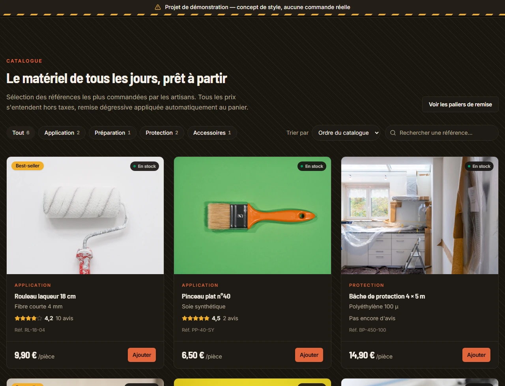 |

La bascule est dans les deux en-têtes. Sans choix explicite, la préférence
système est suivie et continue de l'être si elle change ; un clic enregistre un
choix dans `localStorage` qui prend alors le dessus. Un script en ligne dans
`index.html` pose `data-theme` avant la feuille de styles, sinon la page
apparaîtrait en clair avant de basculer.

Deux ajustements ont été nécessaires, le reste suivant tout seul : la brique
s'éclaircit — à sa valeur claire elle passait sous le seuil de lisibilité en
texte sur fond sombre — et le palier tarifaire mis en avant reçoit un liseré
d'accent, son fond charbon ne le distinguant plus quand toutes les cartes sont
déjà sombres. Les contrastes des deux thèmes ont été mesurés dans le
navigateur : tous au-dessus du seuil AA (le plus bas, le libellé de catégorie
en brique sur carte, est à 5,06 en sombre et 5,91 en clair).

## Photos

Les visuels produit et catégories sont dans `public/produits/` (WebP, 1000 px de
large) et référencés par leur chemin dans `data/produits.ts` — aucune dépendance
réseau à l'exécution. Leur provenance est listée dans
[`public/produits/SOURCES.md`](public/produits/SOURCES.md). Pour une vraie
boutique, remplacer les fichiers en gardant les mêmes noms.

## Notes

- C'est une maquette de style, pas une boutique : aucun back-end, aucun moyen
  de paiement branché. Le panier, lui, fonctionne pour de bon — il calcule les
  remises —, mais « Commander » est volontairement désactivé. Les avis déposés,
  les votes d'utilité et les signalements vivent dans la page et disparaissent
  au rechargement, ce que l'interface dit à chaque fois.
- Les apparitions et les effets de survol sont en CSS pur, sans librairie
  d'animation. L'utilitaire `animate-apparition` (défini dans `index.css`) monte
  en `animation-fill-mode: both`, donc l'élément finit toujours visible ; la
  cascade se règle avec `animation-delay` en style inline, et tout est neutralisé
  sous `prefers-reduced-motion: reduce`.
- Si vous déplacez le projet dans un dossier Windows redirigé (OneDrive, dossier
  d'une application packagée), le serveur de dev peut servir les sources non
  transformées : il faut alors ancrer `root` sur `fs.realpathSync(__dirname)` et
  poser `server.fs.strict: false` dans `vite.config.ts`. Inutile ici.
